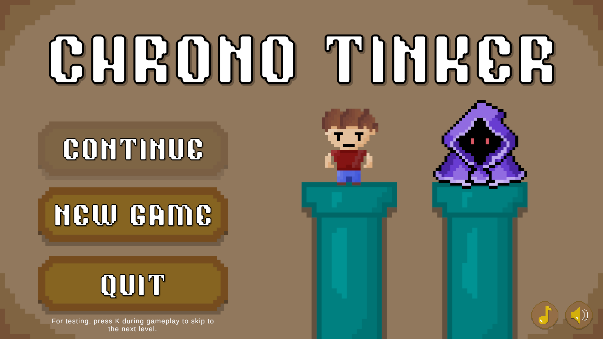
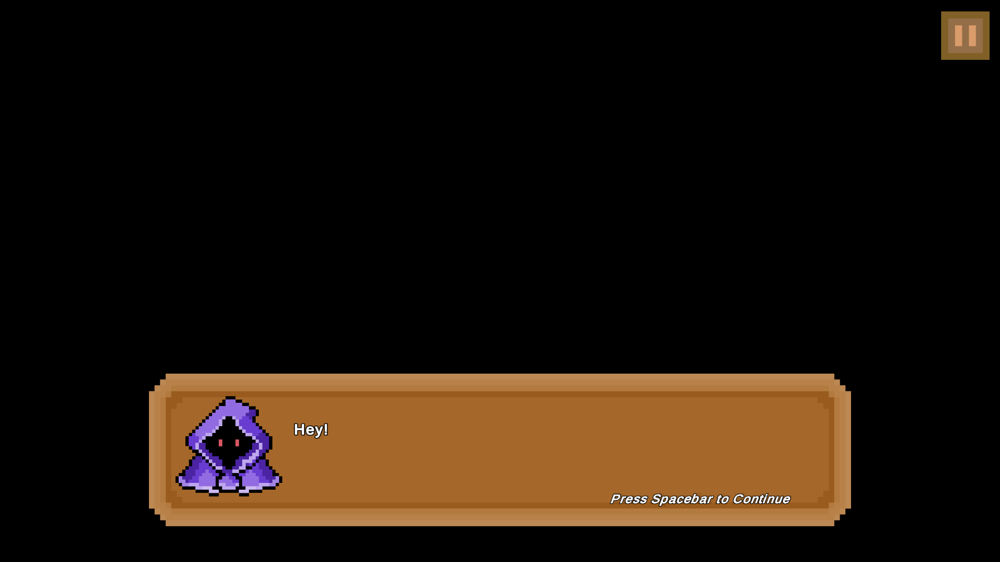
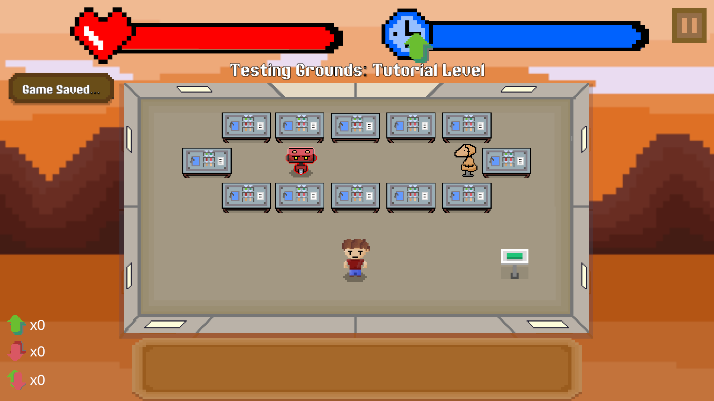

# 🕰️ Chrono Tinker

Chrono Tinker is a **top-down 2D survival game** built in Unity, blending fast-paced time manipulation mechanics with dark satire and retro-futuristic charm. Dive into the chaotic corridors of a mysterious time lab, evade deadly robots, and bend time itself to survive.

  
  
  

---

## 🎮 Premise

Meet **Steve** – your average, everyday guy who took the wrong job offer. Now he’s the guinea pig in an illegal time manipulation experiment run by the secretive **Chrono Syndicate**. Navigate the Syndicate’s labyrinthine facility, survive waves of robotic enforcers, and uncover the sinister purpose behind their experiments. All with a smirk, a shrug, and some seriously questionable life choices.

---

## 🌍 Setting

Chrono Tinker unfolds in a retro-futuristic laboratory complex riddled with:

- 🪑 Endless arrangements of reused tables as obstacles — no spikes, no lasers, just... tables  
- 🕹️ Button puzzles hidden in cluttered room layouts that Steve has to solve to progress  
- 🤖 Low-budget robots that chase Steve like overexcited Roombas  
- 🌫️ Bland hallways and recycled assets, sold as "experimental chambers" by the Syndicate  
- 🧥 Hooded figures appear every 5 levels with mysterious upgrade offers  
- 💬 Constant, sarcastic back-and-forth between Steve and the Chrono Syndicate via floating chat boxes

---

## 🧠 Core Gameplay Features

- **Time Manipulation Powers**  
  - ⏳ Slow Time  
  - 🛑 Stop Time  
  - ⚡ Speed Up Time  

- **Progression & Upgrades**  
  - 20 levels of growing challenge  
  - 3 types of robotic enemies  
  - Choose from upgrades every 5 levels:  
    - Slower energy loss  
    - Faster energy gain  
    - Longer time stop

- **Narrative & Environmental Storytelling**  
  - Dialogue system with live commentary from the Chrono Syndicate  
  - Narrative milestones with in-game artifacts (notes, documents, lab signs)  
  - Strong world-building through environmental design

---

## 🕹️ Controls

| Action                  | Key           |
|------------------------|---------------|
| Move Up                | `↑`           |
| Move Down              | `↓`           |
| Move Left              | `←`           |
| Move Right             | `→`           |
| Slow Time              | `Z`           |
| Speed Up Time          | `C`           |
| Stop Time              | `X`           |
| Pause Menu             | `Esc`         |

✔ Designed for keyboard and mouse  
✔ Visual feedback for all actions  
✔ On-screen prompts help ease learning

---

## 🔧 Built With

- Unity 2022+
- C# (MonoBehaviour scripts)
- JSON (for save/load data)
- Free & Open-source SFX libraries

## 🚀 Get Started

1. Clone the repo
2. Run `ChronoTinker.exe` to play
3. Have fun dodging time-warped robots!
